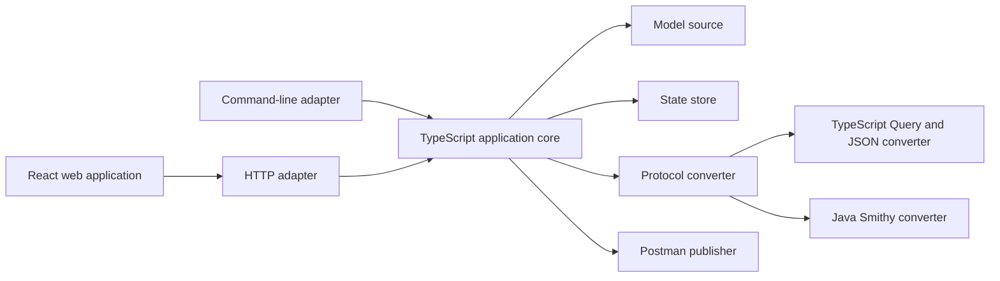

# ADR-0001: TypeScript Core and Portable Execution

- Status: Accepted
- Decision date: 2026-08-16
- Scope: Pipeline runtime, local web application, optional AWS deployment, and public release

## Implementation Status

Implemented on 2026-08-16.

- `backend/` contains the shared TypeScript core, command-line adapter, and local HTTP adapter.
- AWS Query, EC2 Query, and AWS JSON conversion run in TypeScript.
- REST JSON and REST XML conversion continue through the Java 17 adapter.
- The Python command, server, converter, and tests have been removed.
- An optional managed clone uses `https://github.com/aws/api-models-aws.git` by default.
- The public repository name is `SJESDemos/postman-collection-generator`.

An architecture decision record (ADR) is a versioned document that captures a binding technical
choice, its rationale, and its consequences.

## Context

The project currently splits runtime behavior across three Python entry points:

- `apisync.py` owns command handling, Git synchronization, state, conversion orchestration,
  Postman publishing, and reports.
- `webui.py` owns the local HTTP interface, service catalog, tracking changes, and job management.
- `scripts/smithy-to-openapi.py` converts AWS Query, EC2 Query, and AWS JSON protocols.

The browser application is already implemented with React, Vite, and TypeScript. The REST JSON
and REST XML conversion path uses Java 17 and the official Smithy libraries.

The target repository must be suitable for public use. It cannot depend on a personal Git fork,
personal Postman workspace, macOS Keychain, hard-coded sibling checkout, or private Git history.

## Decision

### 1. Use one shared TypeScript application core

All pipeline rules will move into a runtime-independent TypeScript core. The command-line
application and browser-facing HTTP adapter will call the same use cases in process.

The core will expose explicit interfaces for external responsibilities:

- `ModelSource` provides Smithy models from a local checkout or managed cache.
- `StateStore` persists configuration, collection mappings, operation inventories, and reports.
- `OpenApiConverter` converts one selected service model into OpenAPI.
- `CollectionBuilder` converts OpenAPI into a Postman Collection.
- `CollectionPublisher` reads and writes collections through the Postman API.
- `RepositoryMirror` optionally synchronizes a user-configured Git fork.
- `SecretProvider` retrieves credentials without exposing them to the browser.
- `JobStore` records job state for the selected runtime.

HTTP routing, terminal rendering, Git commands, files, AWS services, and Postman requests will stay
outside the application core.

### 2. Define portability as Python-free and cross-platform

The first portable release will support macOS, Linux, and Windows with these prerequisites:

- Node.js 24 long-term support release
- Java 17
- Git

Python will not be required. A Node-only implementation is not part of this decision.

Configuration and state will use `APISYNC_HOME` when supplied. Otherwise, they will use the
operating system's standard application-data location. No runtime path may assume a sibling model
repository or a specific remote name.

Local secrets will use environment variables. The local runtime will not require an operating
system credential store or native add-on.

### 3. Preserve the Java Smithy conversion path

The official Smithy Java conversion path will remain behind `OpenApiConverter` for `restJson1` and
`restXml` services. Reimplementing those semantics in TypeScript would increase compatibility risk
without being necessary to remove Python.

The Python converter behavior for these protocols will move to TypeScript:

- `awsJson1_0`
- `awsJson1_1`
- `awsQuery`
- `ec2Query`

Protocol behavior is binding. Query services such as SNS, STS, and IAM will use form-encoded
`Action` and `Version` fields. Their generated examples and tests must accept XML responses.
AWS JSON services will use their protocol-specific content type, target header, and JSON body.

### 4. Make personal fork synchronization optional

Reading upstream AWS models must not require a personal fork. Users may choose one of these model
sources:

- An existing local checkout
- A managed local cache cloned by the application
- A future runtime-specific remote source

Pushing merged changes to a fork will be provided only through the optional `RepositoryMirror`
interface. Remote names, branches, and credentials will be explicit configuration.

### 5. Keep AWS deployment optional and in the same repository

The repository may contain an optional `deploy/aws` module. Local operation must not require an
AWS account or deployed backend.

The static React application may be hosted with S3, CloudFront, and WAF. State-changing browser
operations require a protected API and execution backend. The exact authentication provider,
workflow service, job execution service, and tenancy model require a separate deployment decision
before implementation.

### 6. License the public project under Apache-2.0

The public source will use the Apache License, Version 2.0. The distribution will include:

- `LICENSE`
- `NOTICE`
- `THIRD_PARTY_NOTICES.md`
- SPDX license identifiers
- A generated software bill of materials containing dependency and license information

Contributor guidance will use Developer Certificate of Origin sign-off unless a later governance
decision replaces it.

### 7. Publish from a fresh sanitized Git history

The current repository and its history will remain private. The public repository will start from
a reviewed source snapshot in a separate directory with a new `.git` directory.

The public repository must not receive the private repository as a remote. It must not contain
private commits, tags, branches, reflogs, workspace identifiers, personal fork names, credentials,
account identifiers, or private screenshots.

## Target Structure

```text
apps/
  web/
  local-server/
packages/
  contracts/
  core/
  cli/
  api/
  model-source/
  converter-query/
  converter-postman/
  postman-client/
  state-file/
  testing/
java/
  smithy-openapi/
deploy/
  aws/
docs/
  decisions/
```

Package boundaries may be combined when implementation shows that a separate package adds no
meaningful ownership or testing boundary. The core interfaces and runtime separation are binding.

## Runtime Flow



## Migration Sequence

1. Establish approved input and output fixtures for every supported AWS protocol.
2. Add the TypeScript workspace, shared contracts, and core interfaces.
3. Port the Python Query and JSON converter with fixture parity.
4. Port `check`, `refresh`, `adopt`, and `reconcile` into the shared core and command line.
5. Replace the Python local HTTP server without changing the browser request contract unnecessarily.
6. Run the Python and TypeScript implementations in read-only comparison mode.
7. Remove Python after all parity and portability gates pass. Completed.
8. Prepare the sanitized public snapshot and initialize the separate public history. In progress.
9. Design the optional AWS deployment through a separate approval checkpoint.

## Acceptance Gates

- Target selection matches the current command-line behavior.
- Every fixture produces the approved operation inventory.
- Generated Postman requests preserve protocol-specific wire behavior.
- SNS Query requests use form data and accept XML responses.
- Normalized collection hashes are stable.
- Dry-run reports contain the same material changes.
- Publishing remains disabled during comparison testing.
- Automated tests pass on supported macOS, Linux, and Windows runners.
- Secret and personal-metadata scans pass before public publication.

## Consequences

### Benefits

- Command-line and web behavior use one implementation.
- Python is removed without duplicating proven Smithy Java behavior.
- Local users do not need an AWS account or personal fork.
- Storage, Git, secrets, and hosting choices remain replaceable.
- The same core can support local and optional AWS runtimes.

### Costs and risks

- Java 17 and Git remain initial prerequisites.
- Behavioral parity requires protocol fixtures and comparison tooling.
- Cross-platform process handling and file locking require explicit tests.
- State files need schema versions and forward migrations.
- Public release requires a deliberate source export instead of pushing the current repository.

## Deferred Decisions

These items require separate approval and are not authorized by this record:

- Replacing the Java converter with a Node-only implementation
- Replacing system Git with a JavaScript Git implementation
- Selecting the AWS authentication provider
- Selecting the AWS job execution and workflow services
- Supporting multiple users or multiple Postman workspaces in one deployment
